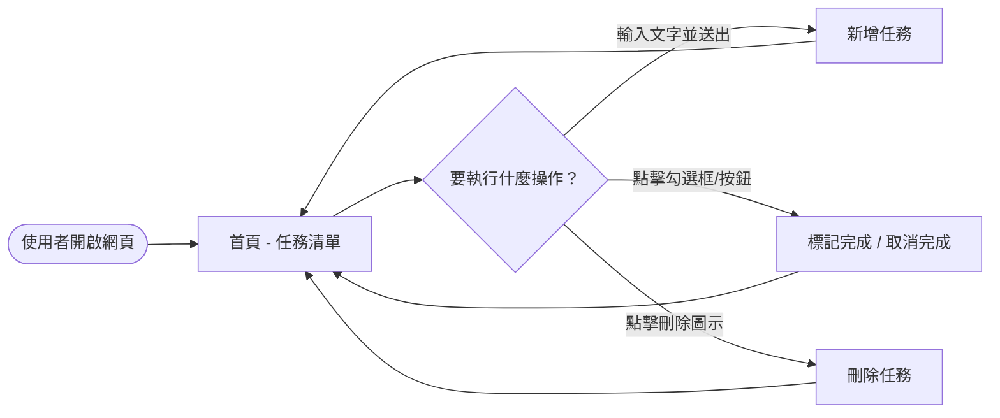
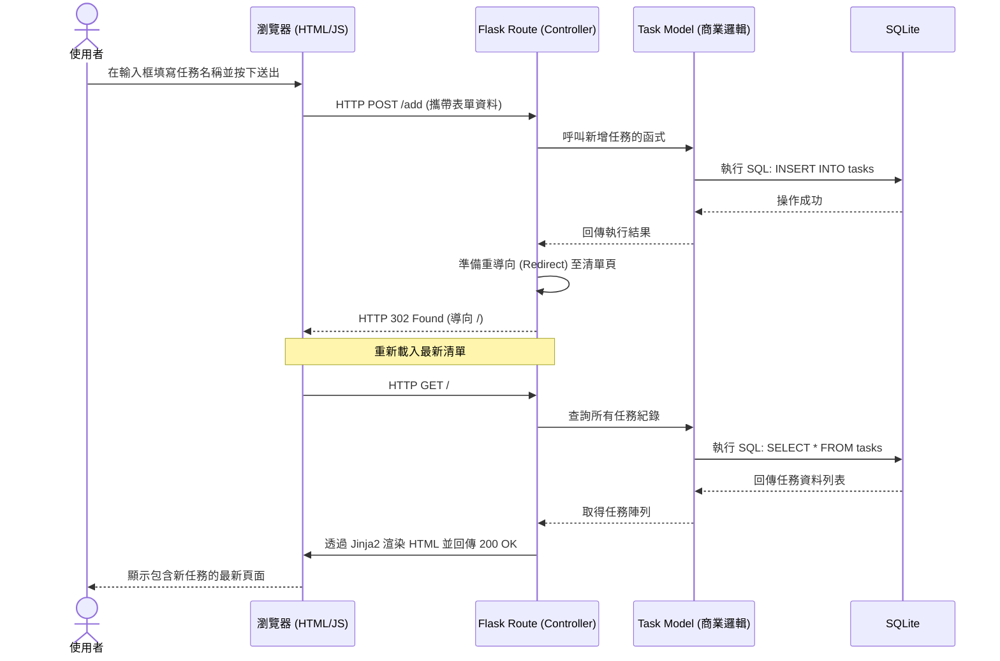

# 系統流程圖 (FLOWCHART)：任務管理系統

## 1. 使用者流程圖 (User Flow)

這個流程圖描述了使用者從進入網站開始的操作路徑，涵蓋任務的瀏覽、新增、狀態切換與刪除等行為。

## 2. 系統序列圖 (Sequence Diagram)

此序列圖描述了一次典型操作的後端處理流程。我們以「使用者新增任務」為例，展示了從前端送出表單至後端寫入資料庫並回傳更新後頁面的完整內部動作。

## 3. 功能清單對照表

本表格將 PRD 中規劃的功能，詳細對應至未來架構的 Endpoint 設計（URL 路徑與使用的 HTTP 方法）。

| 功能描述 | HTTP 方法 | URL 路徑 (預計) | 行為與說明 |
|----------|-----------|-----------------|------------|
| 顯示任務清單 | GET | `/` | 回傳首頁，列出資料庫中「未完成」與「已完成」的任務清單版面。 |
| 新增任務 | POST | `/add` | 接收來自表單的任務名稱字串，將其新增至資料庫後，重導向回首頁 (`/`)。 |
| 切換完成狀態 | POST | `/toggle/<int:task_id>` | 依據傳入的任務 ID 給予相反的完成狀態（未完成變完成、完成變未完成）。為考慮安全性，採用 POST 方法進行變更。 |
| 刪除任務 | POST | `/delete/<int:task_id>` | 針對特定任務 ID 進行資料庫刪除操作，成功後再重導向回首頁。 |

> 備註：上述路由與 Endpoint 的設計為初步規劃，後續能依據 API 階段做調整或優化。
